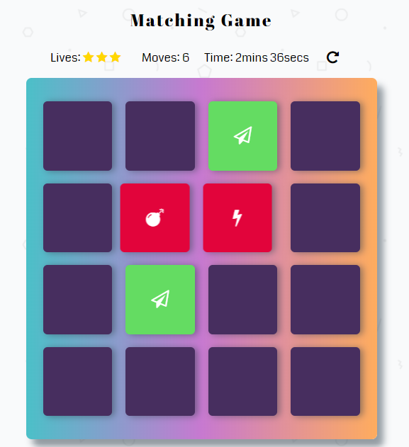

# Memory Game Project

## Table of Contents

* [General](#general)
* [How to play](#how-to-play)
* [Instructions](#instructions)
* [Special features](#special-features)
* [Resources](#resources)

## General:

This game was built as a Udacity Course project. The Memory Game Project is all about demonstrating your mastery of HTML, CSS, and JavaScript.

## How to play:

Load this link in your browser https://patibugaj.github.io/fend-project-memory-game/

### Instructions:

The game board consists of sixteen cards shuffled in a grid. The deck is made of the eight pairs of cards, each with different symbols on one side.

The game is started when the player flips two cards.

On each turn:

- The player flips one card over to reveal its underlying symbol.
- The player then turns over a second card, trying to find the corresponding card with the same symbol.
- If the cards match, both cards stay flipped over.
- If the cards do not match, both cards are returned to their initial hidden state.

- The game ends once all cards have been correctly matched, time is over or user loose all lives.

### Special features:

- The game features a timer that countdown the time left in the game and to keep track of how long it takes to win and reports time on win/lose screen. When only 10 secs left, the timer flashes and text color changes to red.
- The player starts out with a three star rating. Player lose one star after 7th, 14th and 21st move. One move counts when player flips two cards. After 21 moves the game is over.
- When the game ends, a pop-up appears. The content depend on type of the ending. Mostly it consists the elapsed time, final star rating and a 'play again' button.

## Resources:

### Array shuffle:

- <http://stackoverflow.com/questions/2450954/how-to-randomize-shuffle-a-javascript-array>

### Icons

- <https://maxcdn.bootstrapcdn.com/font-awesome/4.6.1/css/font-awesome.min.css>

### Animations

- <https://cdn.jsdelivr.net/npm/animate.css@3.5.2/animate.min.css>

### Button CSS

- <http://css3buttongenerator.com/>

### Fonts

- <https://fonts.googleapis.com/css?family=Abril+Fatface>
- <https://fonts.googleapis.com/css?family=Coda>

### GIF

- <https://media.giphy.com/media/DKnMqdm9i980E/giphy.gif>

### GIT

- <https://git-scm.com/book/en/v2>

### Udacity Resources:

- [Project Description](https://classroom.udacity.com/nanodegrees/nd016beta/parts/45080fba-9129-4bd9-869f-548be080accf/modules/677caa06-55d6-444e-a853-08627c5516a7/lessons/4227cbf4-f6ce-4798-a7e5-b1ce3b9e7c33/concepts/0a38769e-8e23-4e3f-9482-d8d1aa80fbb6)
- [Project Rubric](https://review.udacity.com/#!/rubrics/591/view)
